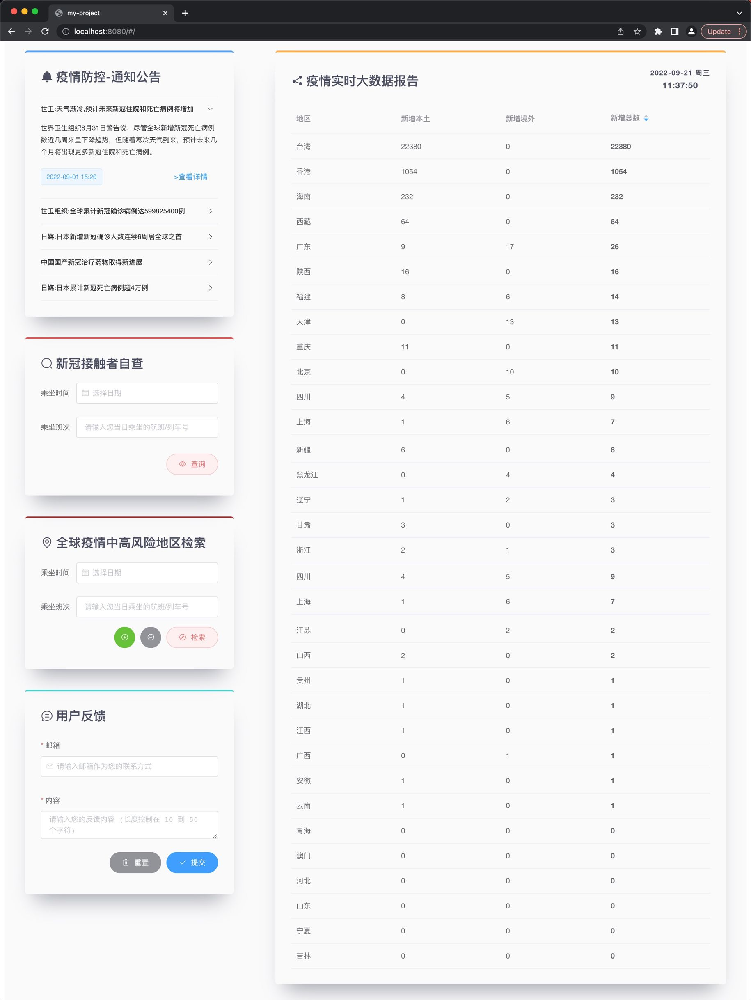
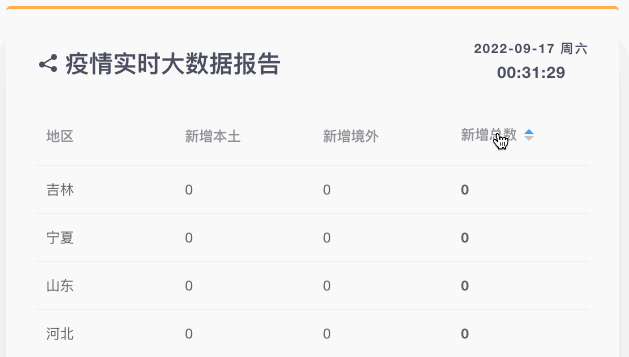
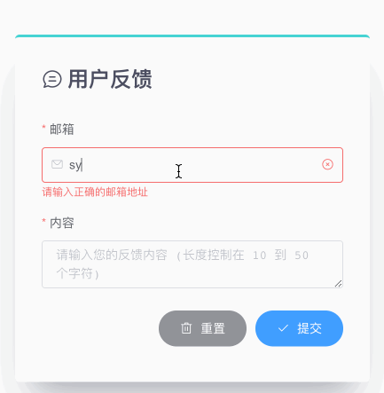
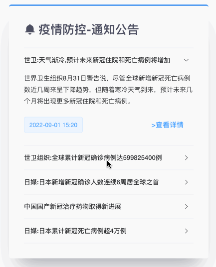
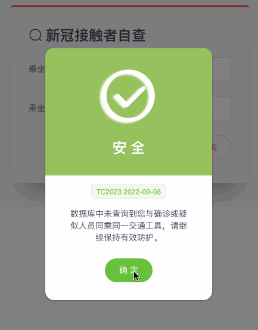
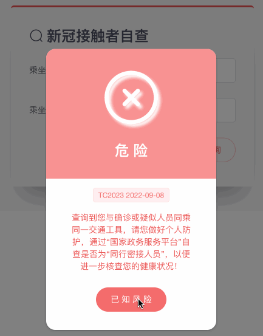
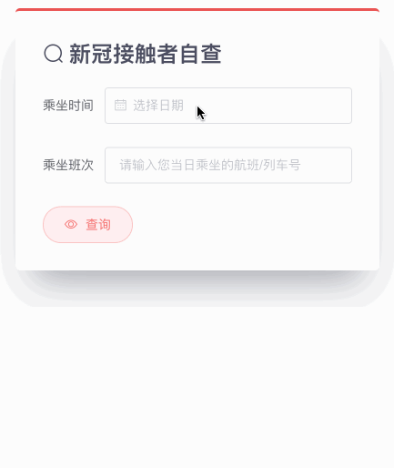
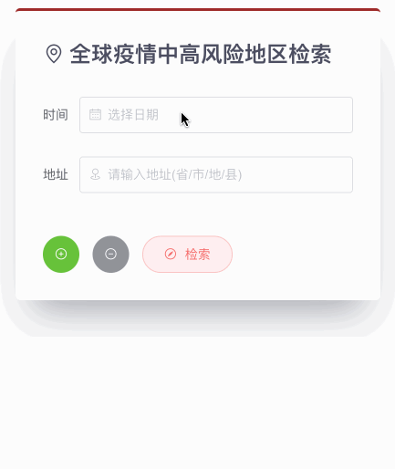

<div align="center">
  <a href="https://github.com/sylvanding/covid19-self-triage">
    
  </a>
  <h3 align="center">COVID19-Self-Triage</h3>
  <a href="https://github.com/sylvanding">
    
  </a>
  <a href="LICENSE">
    
  </a>
  <p align="center">
    Sylvan Ding's first Vue.js project. It helps users find more information about COVID-19 and assuage their panic. 
    <br />
    <a href="http://sylvanding.github.io/covid19-self-triage"><strong>Explore the docs »</strong></a>
    <br />
    <br />
    <a href="https://github.com/sylvanding/covid19-self-triage">View Demo</a>
    ·
    <a href="https://github.com/sylvanding/covid19-self-triage/issues">Report Bug</a>
    ·
    <a href="https://github.com/sylvanding/covid19-self-triage/pulls">Request Feature</a>
  </p>
</div>





## Table of Contents

- [Table of Contents](#table-of-contents)
- [Key Features](#key-features)
- [Dev Environment](#dev-environment)
- [Build With](#build-with)
- [Build Setup](#build-setup)
  - [npm](#npm)
  - [Manually](#manually)
    - [Element UI](#element-ui)
      - [On demand](#on-demand)
      - [DatePicker problem](#datepicker-problem)
    - [Axios](#axios)
      - [Encapsulation](#encapsulation)
      - [URL-Encoding](#url-encoding)
      - [Cross-domain](#cross-domain)
    - [Express](#express)
      - [Router](#router)
      - [Port Setting](#port-setting)
      - [Usage](#usage)
    - [Pre-Processor](#pre-processor)
- [VS Code Config](#vs-code-config)
  - [Setting up Vetur with VS Code](#setting-up-vetur-with-vs-code)
  - [Setting up ESLint and Prettier with VS Code](#setting-up-eslint-and-prettier-with-vs-code)
- [Components](#components)
  - [MyCard](#mycard)
    - [Usage](#usage-1)
    - [Attributes](#attributes)
  - [Statistics](#statistics)
    - [Usage](#usage-2)
    - [Attributes](#attributes-1)
    - [API](#api)
      - [Query Params](#query-params)
      - [Response](#response)
  - [Feedback](#feedback)
    - [Usage](#usage-3)
    - [Attributes](#attributes-2)
    - [API](#api-1)
      - [Query Params](#query-params-1)
      - [Response](#response-1)
  - [Notice](#notice)
    - [Usage](#usage-4)
    - [Attributes](#attributes-3)
    - [API](#api-2)
      - [Query Params](#query-params-2)
      - [Response](#response-2)
  - [ContactsCheckResultDialog](#contactscheckresultdialog)
    - [Usage](#usage-5)
    - [Attributes](#attributes-4)
  - [ContactsCheck](#contactscheck)
    - [Usage](#usage-6)
    - [Attributes](#attributes-5)
    - [API](#api-3)
      - [Query Params](#query-params-3)
      - [Response](#response-3)
  - [RegionsSearch](#regionssearch)
    - [Usage](#usage-7)
    - [Attributes](#attributes-6)
    - [API](#api-4)
      - [Query Params](#query-params-4)
      - [Response](#response-4)
    - [POI](#poi)
    - [Notification Overlapping Problem](#notification-overlapping-problem)
    - [Vue.VNode](#vuevnode)
- [Usage](#usage-8)
- [Docker](#docker)
  - [Environment](#environment)
  - [Installation](#installation)
  - [Build Images and Run Containers of Vue.js App](#build-images-and-run-containers-of-vuejs-app)
    - [Dev](#dev)
    - [Prod](#prod)
  - [View Nginx Access Logs](#view-nginx-access-logs)
- [License](#license)

## Key Features

* Perfect the documentation
* Rebuild Element UI
* Specify code style and format
* Customize Card Component
* Globalize Less file
* Encapsulate Axios
* Integrate Express
* Dockerize Vue.js App
* Innovate address inputTips based on Autocomplete component of Element UI
* Distinguish between development environment and production environment

## Dev Environment

| node    | 14.16.1 |
| ------- | ------- |
| npm     | 8.18.0  |
| vue-cli | 2.9.6   |
| vue     | 2.5.2   |

## Build With

* [](https://vuejs.org/)
* [![ElementUI](https://img.shields.io/badge/Element-35495E?style=for-the-badge&logo=data:image/svg+xml;base64,PD94bWwgdmVyc2lvbj0iMS4wIiBlbmNvZGluZz0iVVRGLTgiIHN0YW5kYWxvbmU9Im5vIj8+Cjxzdmcgd2lkdGg9IjMwcHgiIGhlaWdodD0iMzBweCIgdmlld0JveD0iMCAwIDM4IDQ4IiB2ZXJzaW9uPSIxLjEiIHhtbG5zPSJodHRwOi8vd3d3LnczLm9yZy8yMDAwL3N2ZyIgeG1sbnM6eGxpbms9Imh0dHA6Ly93d3cudzMub3JnLzE5OTkveGxpbmsiPgogICAgPCEtLSBHZW5lcmF0b3I6IFNrZXRjaCA0MCAoMzM3NjIpIC0gaHR0cDovL3d3dy5ib2hlbWlhbmNvZGluZy5jb20vc2tldGNoIC0tPgogICAgPHRpdGxlPlNoYXBlIENvcHk8L3RpdGxlPgogICAgPGRlc2M+Q3JlYXRlZCB3aXRoIFNrZXRjaC48L2Rlc2M+CiAgICA8ZGVmcz48L2RlZnM+CiAgICA8ZyBpZD0idjIuMi4wIiBzdHJva2U9Im5vbmUiIHN0cm9rZS13aWR0aD0iMSIgZmlsbD0ibm9uZSIgZmlsbC1ydWxlPSJldmVub2RkIj4KICAgICAgICA8ZyBpZD0i6aaW6aG1Lem7mOiupOaViOaenC1jb3B5LTIiIHRyYW5zZm9ybT0idHJhbnNsYXRlKC03MC4wMDAwMDAsIC0xOS4wMDAwMDApIiBmaWxsPSIjNDA5RUZGIj4KICAgICAgICAgICAgPHBhdGggZD0iTTIxMi4xMzU0NDEsNDUuMTU3ODA3NyBaIE0xMDMuNDE2NTAyLDQ2LjIxNzU1MTEgQzEwMy40MDcwMDgsNDcuNzk0NTY4MiAxMDIuNTg3ODQxLDQ4LjE0NjM0NzQgMTAyLjU4Nzg0MSw0OC4xNDYzNDc0IEMxMDIuNTg3ODQxLDQ4LjE0NjM0NzQgODguNDUyMDQ3OCw1Ni4zMTQ1MDg3IDg3LjUzMjk5NTYsNTYuODI2Mjc1MSBDODYuNjIyMzM2LDU3LjIxNzE1NjEgODYuMDEzNjcwMyw1Ni44MjYyNzUxIDg2LjAxMzY3MDMsNTYuODI2Mjc1MSBDODYuMDEzNjcwMyw1Ni44MjYyNzUxIDcxLjIyMjU3MDYsNDguMjQ3OTU3MiA3MC42ODI2OTYyLDQ3Ljg3MDg0NDQgQzcwLjE0MjY4NDMsNDcuNDkzNzMxNiA3MC4xMzAxNjQzLDQ2LjkwNjM3NzQgNzAuMTMwMTY0Myw0Ni45MDYzNzc0IEM3MC4xMzAxNjQzLDQ2LjkwNjM3NzQgNzAuMTQ1MDIzMiwyOS45MTk5MTc0IDcwLjEzMDE2NDMsMjkuMTMzMzM2NCBDNzAuMTE1MzA1MywyOC4zNDY2MTc3IDcxLjA5Njk1NzYsMjcuNzU1NTQ2MSA3MS4wOTY5NTc2LDI3Ljc1NTU0NjEgTDg1Ljg3NTUzNzMsMTkuMjEzNDM4NyBDODYuNzg1MzcxNCwxOC43MzMyMDE2IDg3LjY3MTEyODYsMTkuMjEzNDM4NyA4Ny42NzExMjg2LDE5LjIxMzQzODcgQzg3LjY3MTEyODYsMTkuMjEzNDM4NyAxMDAuNzI2NjIzLDI2LjgwMjA5MzcgMTAyLjE3MzQ0MiwyNy42MTc3MjU3IEMxMDMuNTkxNTA3LDI4LjI5MTk1NzcgMTAzLjQxNjUwMiwyOS42ODQzNDI0IDEwMy40MTY1MDIsMjkuNjg0MzQyNCBDMTAzLjQxNjUwMiwyOS42ODQzNDI0IDEwMy40MjUzMDcsNDQuNzUxOTE5MiAxMDMuNDE2NTAyLDQ2LjIxNzU1MTEgTDEwMy40MTY1MDIsNDYuMjE3NTUxMSBaIE05Ny41MTYwMTA1LDI5LjE2OTEzMzkgQzk0LjQ5MDAxNzMsMjcuNDI3NDQ4MyA4Ny4zNjE1ODQyLDIzLjI5NzEwNjMgODcuMzYxNTg0MiwyMy4yOTcxMDYzIEM4Ny4zNjE1ODQyLDIzLjI5NzEwNjMgODYuNjY2MTAzOSwyMi45MjEyMzI2IDg1Ljk1MTc3NDcsMjMuMjk3MTA2MyBMNzQuMzQ4NzQwNiwyOS45ODIxNSBDNzQuMzQ4NzQwNiwyOS45ODIxNSA3My41NzgwMDI1LDMwLjQ0NDkwMTQgNzMuNTg5Njk3LDMxLjA2MDQ4MDUgQzczLjYwMTM5MTUsMzEuNjc2MDU5NyA3My41ODk2OTcsNDQuOTY5ODcwOCA3My41ODk2OTcsNDQuOTY5ODcwOCBDNzMuNTg5Njk3LDQ0Ljk2OTg3MDggNzMuNTk5NDY1NCw0NS40Mjk1OTMyIDc0LjAyMzQ5NTEsNDUuNzI0NjQ3MiBDNzQuNDQ3Mzg3Myw0Ni4wMTk3MDExIDg2LjA2MDE4OTgsNTIuNzMzMjQ1MSA4Ni4wNjAxODk4LDUyLjczMzI0NTEgQzg2LjA2MDE4OTgsNTIuNzMzMjQ1MSA4Ni41MzgxNTIsNTMuMDM5MTc1OSA4Ny4yNTMwMzE1LDUyLjczMzI0NTEgQzg3Ljk3NDY1MjYsNTIuMzMyNzI2MiA5OS4wNzMwMzM1LDQ1Ljk0MDI1ODIgOTkuMDczMDMzNSw0NS45NDAyNTgyIEM5OS4wNzMwMzM1LDQ1Ljk0MDI1ODIgOTkuNzE2MjMyNSw0NS42NjQ4OTI5IDk5LjcyMzY2MTksNDQuNDMwNzA1NiBDOTkuNzI1NzI1Nyw0NC4wNzQ3OTU5IDk5LjcyNjU1MTIsNDIuNjkzMjg4MSA5OS43MjY2ODg3LDQwLjk1NzUyMjkgTDg2LjY2MDA1MDIsNDguODc1MjM5NCBMODYuNjYwMDUwMiw0NS44NDYyMjEgQzg2LjY2MDA1MDIsNDQuNjAyMTIwNSA4Ny42MjMxMjg5LDQzLjc4MDk4MTEgODcuNjIzMTI4OSw0My43ODA5ODExIEw5OS4xODA3NjA3LDM2LjgxNjU3OTMgQzk5LjYxNjg5NzgsMzYuMzYxMTI1MSA5OS43MDY4NzY4LDM1LjYzMTU0NDcgOTkuNzI1NDUwNSwzNS4zNTU2Mjg3IEM5OS43MjUwMzc4LDM0LjA5MDQ2MjcgOTkuNzI0NDg3NCwzMi45ODUyODQxIDk5LjcyNDA3NDcsMzIuMjg1MTY3OCBMODYuNjYwMDUwMiw0MC4yMDEyMzIxIEw4Ni42NjAwNTAyLDM3LjAzNDUzMSBDODYuNjYwMDUwMiwzNS43OTA0MzA1IDg3LjQ4NTU0NjIsMzUuMjQ0NjU2NCA4Ny40ODU1NDYyLDM1LjI0NDY1NjQgTDk3LjUxNjAxMDUsMjkuMTY5MTMzOSBaIiBpZD0iU2hhcGUtQ29weSI+PC9wYXRoPgogICAgICAgIDwvZz4KICAgIDwvZz4KPC9zdmc+)](https://element.eleme.cn)
* [](https://www.docker.com/)

## Build Setup

### npm

Use command `npm install` to automatically install any packages that the project depends on. 

``` shell
# check node's version
node -v # v14.16.1

# check npm's version
npm -v # v8.18.0

# install dependencies
npm install --legacy-peer-deps
```

### Manually

If you choose to start from `Vue CLI` webpack template, install all packages manually and make sure **not** to automatically install any compatible updates to vulnerable dependencies by `npm audit fix`. 

```shell
# install vue globally
npm install -g vue-cli

# check vue's version
vue -V # 2.9.6

# use vue template `webpack` to create a project
vue init webpack my-project

? Project name my-project
? Project description A Vue.js project
? Author Sylvan Ding <sylvanding@qq.com>
? Vue build standalone
? Install vue-router? Yes
? Use ESLint to lint your code? Yes
? Pick an ESLint preset Standard
? Set up unit tests No
? Setup e2e tests with Nightwatch? No
? Should we run `npm install` for you after the project has been created? (recommended) no

cd my-project

npm install
```

#### Element UI

```shell
npm i element-ui -S
```

##### On demand

With the help of `babel-plugin-component`, we can import components we actually need, making the project smaller than otherwise.

First, install `babel-plugin-component` and `babel-preset-es2015`:

```shell
npm install babel-plugin-component -D
npm install --save-dev babel-preset-es2015
```

Then add the following preset and plugins to `.babelrc`:

```js
{
  "presets": [["es2015", { "modules": false }]],
  "plugins": [
    [
      "component",
      {
        "libraryName": "element-ui",
        "styleLibraryName": "theme-chalk"
      }
    ]
  ]
}
```

Next, we edit `main.js` to import components globally:

```js
import Vue from 'vue';
import { Button, Select } from 'element-ui';
import App from './App.vue';

Vue.component(Button.name, Button);
Vue.component(Select.name, Select);
/* or
 * Vue.use(Button)
 * Vue.use(Select)
 */

new Vue({
  el: '#app',
  render: h => h(App)
});
```

##### DatePicker problem

When using `el-date-picker`, the browser console would send a vue warning: 

```
... Prop being mutated: "placement" found in <ElDatePicker> ...
```

The problem arose because the latest element-ui (v2.15.9) changes vue props `placement` in the child component `date-picker`, which is not allowed in vue since the value will be overwritten whenever the parent component re-renders. The source code causing this issue seems like:

```js
// node_modules/element-ui/packages/date-picker/src/picker.vue

const NewPopper = {
  props: {
    placement: Popper.props.placement,
  },
};

const PLACEMENT_MAP = {
  left: 'bottom-start',
  center: 'bottom',
  right: 'bottom-end'
};

export default {
  created() {
    // vue-popper
    this.popperOptions = {
      boundariesPadding: 0,
      gpuAcceleration: false
    };
    this.placement = PLACEMENT_MAP[this.align] || PLACEMENT_MAP.left;

    this.$on('fieldReset', this.handleFieldReset);
  },
}
```

Note that `this.placement = PLACEMENT_MAP[this.align] || PLACEMENT_MAP.left;` modified props `placement`. We resolve the problem by just simply muting this code according to [#21943](https://github.com/ElemeFE/element/issues/21943). 

We use `patch-package` to make and keep fixes to npm dependencies:

```shell
# install patch-package
npm i patch-package -D --legacy-peer-deps
```

Download element-ui releases [v2.15.9](https://github.com/ElemeFE/element/releases/tag/v2.15.9) on GitHub, make the above modification to your downloaded git repo and rebuild element-ui to overwrite the lib folder in `node_modules/element-ui`:

```shell
cd /path/to/your/repo
npm install --legacy-peer-deps
vim packages/date-picker/src/picker.vue
npm run dist
mv -f /path/to/your/repo/lib /path/to/your/project/node_modules/element-ui/lib
```

> Attention! The version of dependency `node-sass` in element-ui git repo must match your node version. [Node version support policy](https://github.com/sass/node-sass#Node-version-support-policy) tells you about that. Modify package.json in your repo so that no error would be thrown. 

Then we fix this bug in our dependencies after replacing the lib folder of element-ui, and run: 

```shell
# use npx (included with npm > 5.2) to create a .patch file
npx patch-package element-ui

# patch-package 6.4.7
# • Creating temporary folder
# • Installing element-ui@2.15.9 with npm
# • Diffing your files with clean files
# ✔ Created file patches/element-ui+2.15.9.patch
```

If this is the first time you've used `patch-package`, it will create a folder called `patches` in the root dir of your app. Inside will be a file called `element-ui+2.15.9.patch`, which is a diff between normal old package name and your fixed version. Commit this to share the fix with your team: 

```shell
# commit the patch file to share the fix with your team
git add patches/element-ui+2.15.9.patch
git commit -m "fix picker.vue in element-ui@2.15.9"
```

In `package.json`, make the following change to make sure the modification will be kept when reinstall the dependency: 

```diff
 "scripts": {
+  "postinstall": "patch-package"
 }
```

#### Axios

During the development process, Axios needs to be further encapsulated to facilitate its use in the project, which tends to reduce code duplication. 

##### Encapsulation

In order to avoid polluting the global Axios and affect other requests when one request modified, we use `src/utils/requests.js` to create a new instance of axios with a custom config. You can switch different base URLs according to different environments. And all JSON mocks used by Axios in development environment have been put in `static/mock/*.json` for the purpose of keeping web's original file structure, which allows you to access them by `http://localhost:8080/static/mock/*.json`. 

When using Axios to Get data and load it in Element UI components, we import `request.js` and create function `loadData()` in Vue methods, then call this method in the hook function `mounted()`: 

```vue
<script>
import request from '@/utils/request'
export default {
  data() {
    return {
      tableData: [],
    }
  },
  mounted() {
    this.loadData()
  },
  methods: {
    loadData() {
      request.get('/to/mock/file.json').then((response) => {
        this.tableData = response.data
      })
    },
  },
}
</script>
```

##### URL-Encoding

By default, axios serializes JavaScript objects to `JSON`. To send data in the `application/x-www-form-urlencoded` format instead, we config `transformRequest` in `request.js` and use the [`qs`](https://github.com/ljharb/qs) library to encode our data. Make sure that `transformRequest` is only applicable for request methods 'PUT', 'POST', 'PATCH' and 'DELETE', so you wouldn't worry about the 'GET' request polluted. 

```shell
# install library
npm i qs@6.5.3 -S --legacy-peer-deps
```

```js
// request.js
const qs = require('qs')
const instance = axios.create({
  // `transformRequest` allows changes to the request data before it is sent to the server
  // This is only applicable for request methods 'PUT', 'POST', 'PATCH' and 'DELETE'
  // The last function in the array must return a string or an instance of Buffer, ArrayBuffer,
  // FormData or Stream
  // You may modify the headers object.
  transformRequest: [
    function(data, headers) {
      // Do whatever you want to transform the data
      headers['content-type'] = 'application/x-www-form-urlencoded'
      data = qs.stringify(data)
      return data
    },
  ],
})
```

##### Cross-domain

A cross-domain problem happened when a client requests data from the server. Since direct cross-domain access using axios is not feasible, we need to configure the proxy. 

> A proxy server requests data from another server, and then the server returns the requested data to the proxy server, and the proxy server returns the data to the client. 

In the `proxyTable` field in the `index.js` file under the config folder, add the following rule:

```js
// config/index.js

const port = 8080
const devServerPort = 8081

module.exports = {
  dev: {
    // Paths
    assetsSubDirectory: 'static',
    assetsPublicPath: '/',
    proxyTable: {
      '/': {
        target: `http://localhost:${devServerPort}/static/mock`,
        changeOrigin: true, // override the origin of the host header
        pathRewrite: {
          '^/': '', // replace the request address in the target
        },
      },
    },
    // ...
  }
  // ...
}
```

Now axios will replace the beginning symbol `/` to `http://localhost:${devServerPort}/static/mock` in the request address. Make sure that we cancel baseURL configuration under development environment to avoid proxyTable being overridden. 

```js
// src/utils/request.js

const prodBaseURL = 'http://localhost:5000'

let axiosConfig = {
  timeout: 3000,
  // ...
}

// set baseURL under production environment
if (process.env.NODE_ENV === 'production') {
  axiosConfig.baseURL = prodBaseURL
}

const instance = axios.create(axiosConfig)

// ...
```

#### Express

`Express` is a minimal and flexible Node.js web application framework that provides a robust set of features for web and mobile applications. 

When axios used 'POST' method to request mock data in `/static/mock`, it would throw a 404 error, indicating that the JSON file was not found. We, however, are able to do so using 'GET' method. It is a problem that the server can't response correctly, instead of an issue of axios. In our project, we build a simple web server with Express to deal with the 'POST' 404 error. **Note that the server will only work under development environment**. 

##### Router

```shell
# Installation
npm i express morgan -D --legacy-peer-deps
```

> `morgan` is a HTTP request logger middleware for node.js. 

To follow the standard, CommonJS, we create a module named `dev.server.js` in `config/` as our Express configuration and startup file: 

```js
// config/dev.server.js

const path = require('path')
const logger = require('morgan')
const express = require('express')
const feedback_success = require('../static/mock/feedback_success.json')
const feedback_error = require('../static/mock/feedback_error.json')

function run(port) {
  const app = express()
  const router = express.Router()

  // every request gets logged
  router.use(logger())

  // POST method route
  router.post('/mock/feedback_success.json', function(req, res) {
    // send a JSON response
    res.json(feedback_success)
  })
  router.post('/mock/feedback_error.json', function(req, res) {
    res.json(feedback_error)
  })

  // express.static serves all static files
  router.use('/', express.static(path.resolve(__dirname, '../static')))

  // load the router module in the app
  app.use('/static', router)

  // start app
  app.listen(port)
}

module.exports = { run }
```

The above Express app configuration allows you to access any static resources in `/static` by 'GET' method, meanwhile specific resources such as `/mock/feedback_success.json` can also be gotten by 'POST'. 

##### Port Setting

You are allowed to appoint your Express server port in `config/index.js`: 

```js
// config/index.js

const port = 8080
const devServerPort = 8081

module.exports = {
  dev: {
    // ...
    // Various Dev Server settings
    host: 'localhost', // can be overwritten by process.env.HOST
    port, // can be overwritten by process.env.PORT, if port is in use, a free one will be determined
    devServerPort // Express web server port
    // ...
  }
  // ...
}
```

We also set global `process.env` variable `DEVSERVERPORT`, so that you can reference `devServerPort` anywhere in the project. 

```json
// build/webpack.dev.conf.js

//...
module.exports = new Promise((resolve, reject) => {
  portfinder.basePort = process.env.PORT || config.dev.port
  portfinder.getPort((err, port) => {
    if (err) {
      reject(err)
    } else {
      // publish the new Port, necessary for e2e tests
      process.env.PORT = port
      process.env.DEVSERVERPORT = config.dev.devServerPort // !!!
      // add port to devServer config
      devWebpackConfig.devServer.port = port
      // ...
```

##### Usage

Import `dev.server.js` in `config/dev.env.js` and run the server: 

```js
// config/dev.env.js

const devServer = require('./dev.server')
const port = require('./index').dev.devServerPort

// ...

devServer.run(port)
```

For example, when sending 'POST' to `http://localhost:devServerPort/static/mock/feedback_success.json`, you will get the return `{ "res": "1", "msg": "反馈提交成功！" }`. 

#### Pre-Processor

We use `Less` as our pre-processor for the project. You need to manually install the corresponding webpack loaders with correct versions:

```shell
# Less
npm i less@3.9.0 less-loader@4.1.0 -D --legacy-peer-deps
```

Then add the loader to your `webpack` config `build/webpack.base.conf.js`. For example:

```js
module.exports = {
  module: {
    rules: [
      {
        test: /\.less$/i,
        use: [
          // compiles Less to CSS
          "style-loader",
          "css-loader",
          "less-loader",
        ],
      },
    ],
  },
};
```

For every single Vue component, we create a corresponding Less file in `src/assets/styles`. 

You can automatically import files (for colors, variables, mixins...) by   following the next steps.

> Simply using the [style-resources-loader](https://github.com/yenshih/style-resources-loader) or [vue-cli-plugin-style-resources-loader](https://www.npmjs.com/package/vue-cli-plugin-style-resources-loader) to set global less variables is for Vue CLI 3, which creates a new project by running `vue create`. We use Vue CLI 2, running `vue init` to create a project. So make sure that you won't use these packages under Vue CLI 2 environment because `vue.config.js` is unavailable. 

First install the package:

```shell
# install package
npm i sass-resources-loader -D --legacy-peer-deps
```

Then add function `lessResourceLoader` to function `cssLoaders` in file `/build/utils.js`:

```json
function lessResourceLoader() {
    var loaders = [
      cssLoader,
      'less-loader',
      {
        loader: 'sass-resources-loader',
        options: {
          resources: [
            path.resolve(__dirname, '../src/assets/styles/common.less'),
          ]
        }
      }
    ];
    if (options.extract) {
      return ExtractTextPlugin.extract({
        use: loaders,
        fallback: 'vue-style-loader'
      })
    } else {
      return ['vue-style-loader'].concat(loaders)
    }
  }
```

Finally, modify function `cssLoaders` return item `less`:

```json
less: lessResourceLoader()
```

Now `src/assets/styles/common.js` becomes your global style file. 

## VS Code Config

We generally use `ESlint` to help flag potential errors and bugs, and `Prettier` to format and beautify our code. 

### Setting up Vetur with VS Code

The presence of `jsconfig.json` file in a directory indicates that the directory is the root of a JavaScript Project. The `jsconfig.json` file specifies the root files and the options for the features provided by the [JavaScript language service](https://github.com/microsoft/TypeScript/wiki/JavaScript-Language-Service-in-Visual-Studio).

Create a `jsconfig.json`, which will include all Vue files and files that they import from, for example:

```json
{
  "include": [
    "./src/**/*"
  ]
}
```

### Setting up ESLint and Prettier with VS Code

You will need to install the appropriate extension/plugin for your code editor. For `VS Code`, install [ESLint](https://marketplace.visualstudio.com/items?itemName=dbaeumer.vscode-eslint) and [Prettier](https://marketplace.visualstudio.com/items?itemName=esbenp.prettier-vscode). These plugins have millions of downloads each, so it'll be difficult to miss them in the VS Code extension marketplace. Once you've installed these, we are ready to move on to configuring each of them for proper usage.

Linters usually contain not only code quality rules, but also stylistic rules. Most stylistic rules are unnecessary when using Prettier, but worse – they might conflict with Prettier! 

Luckily it’s easy to turn off rules that conflict or are unnecessary with Prettier. Package `eslint-config-prettier` can exclude all ESLint rules that could conflict with Prettier. 

Install eslint-config-prettier:

```shell
npm install eslint-config-prettier --save-dev --legacy-peer-deps
```

You may meet upstream dependency conflict when installing NPM packages with the latest npm version (v8). The effective solution to this error is to pass a command `--legacy-peer-deps` to the npm install that can help ignore the peer dependencies and continue the installation.

Once the setup is successful, you should see a file `eslintrc.js` based on the format you chose your configuration file to be in. 

Then, add `"prettier"` to the "extends" array in your `.eslintrc.js` file. Make sure to put it **last,** so it gets the chance to override other configs.

```json
{
  "extends": [
    "some-other-config-you-use",
    "prettier"
  ]
}
```

Create `.prettierrc` file written in JSON as configuration file for Prettier:

```json
{
  "arrowParens": "always",
  "bracketSameLine": false,
  "bracketSpacing": true,
  "embeddedLanguageFormatting": "auto",
  "htmlWhitespaceSensitivity": "css",
  "insertPragma": false,
  "jsxSingleQuote": false,
  "printWidth": 80,
  "proseWrap": "preserve",
  "quoteProps": "as-needed",
  "requirePragma": false,
  "semi": false,
  "singleQuote": true,
  "tabWidth": 2,
  "trailingComma": "es5",
  "useTabs": false,
  "vueIndentScriptAndStyle": false
}
```

## Components

We follow the design principle: **use components in Element UI only when involving data object corresponding**. The reason is that components provided by Element UI show a bad customization ability, for which we design the component `MyCard` to beautify our page. 

### MyCard

`MyCard` provides a beautiful card container, serving as the basement of the following components.

#### Usage

After globally registering `MyCard`, you can use `<my-card>` in any Vue template: 

```html
<template>
  <el-row>
    <my-card span="24" color="orange">
      <template #header>
        <span>Card Header Here</span>
      </template>
      <div>Main content</div>
    </my-card>
  </el-row>
</template>
```

Referring `el-card`, we define a named slot for card head and an unnamed for card body. Make sure to assign the slot name when expecting to have a card head. Besides, you can set `span` attribute on `<mycard>`, which will be passed to its child component: 

```vue
// src/components/MyCard.vue

<template>
  <el-col :span="span | parseInt">
    <div :class="['my-card', color]">
      <div class="my-card-header">
        <slot name="header"></slot>
      </div>
      <div class="my-card-body">
        <slot></slot>
      </div>
    </div>
  </el-col>
</template>

<script>
export default {
  name: 'MyCard',
  props: {
    span: {
      default: 24,
    },
    color: {
      type: String,
      default: 'blue',
    },
  },
  filters: {
    parseInt: (value) => parseInt(value),
  },
}
</script>

<style lang="less">
@import '../assets/styles/my-card';
</style>
```

#### Attributes

| Attribute | Description                     | Type   | Options                    | Default |
| --------- | ------------------------------- | ------ | -------------------------- | ------- |
| span      | number of column the grid spans | number | -                          | 24      |
| color     | color of the card head          | string | blue/red/cyan/orange/berry | blue    |

### Statistics



Statistics component shows current data report of COVID-19, providing data sorting function. 

#### Usage

```vue
<template>
  <statistics get="/statistics.json"></statistics>
</template>

<script>
import Statistics from '@/components/Statistics.vue'
export default {
  components: {
    statistics: Statistics,
  },
}
</script>
```

#### Attributes

| Attribute | Description                                       | Type   | Options | Default |
| --------- | ------------------------------------------------- | ------ | ------- | ------- |
| get       | url based on axios baseURL to get statistics data | string | -       | -       |

#### API

* Method: `GET`
* Test URL: `/statistics.json`

##### Query Params

None

##### Response

```json
[
  {
    "foreign": "6",
    "local": "1",
    "province": "上海",
    "total": "7"
  },
  {
    "foreign": "0",
    "local": "1",
    "province": "云南",
    "total": "1"
  },
  {
    "foreign": "0",
    "local": "3",
    "province": "内蒙古",
    "total": "3"
  }
]
```

### Feedback



Feedback component submits email and content to the server with axios. It supports data validation and POST request url configuration. 

#### Usage

```vue
<template>
  <feedback post="/feedback_success.json"></feedback>
</template>

<script>
import Feedback from '@/components/Feedback.vue'
export default {
  components: {
    feedback: Feedback,
  },
}
</script>
```

Attribute `post` is based on axios baseURL. For example, the form will be submitted to `http://localhost:devServerPort/static/mock/feedback_success.json`. The submitted attributes include `email` and `content`, of which `string` should be the type. 

#### Attributes

| Attribute | Description                     | Type   | Options | Default |
| --------- | ------------------------------- | ------ | ------- | ------- |
| post      | post url based on axios baseURL | string | -       | -       |

#### API

* Method: `POST`
* Test URL: `/feedback_success.json`, `/feedback_error.json`

##### Query Params

| Attribute | Description | Type   | Options | Require |
| --------- | ----------- | ------ | ------- | ------- |
| email     | -           | string | -       | +       |
| content   | -           | string | -       | +       |

##### Response

There are two kinds of responses: 

```json
// static/mock/feedback_success.json
{ "res": "1", "msg": "反馈提交成功！" }

// static/mock/feedback_error.json
{ "res": "0", "msg": "反馈提交失败！" }
```

### Notice



Notice component shows the latest news and notifications of COVID-19 in every province or district. 

#### Usage

```vue
<template>
  <notice get="/notice.json"></notice>
</template>

<script>
import Notice from '@/components/Notice.vue'
export default {
  components: {
    notice: Notice,
  },
}
</script>
```

#### Attributes

| Attribute | Description                                   | Type   | Options | Default |
| --------- | --------------------------------------------- | ------ | ------- | ------- |
| get       | url based on axios baseURL to get notice data | string | -       | -       |

#### API

* Method: `GET`
* Test URL: `/notice.json`

##### Query Params

None

##### Response

```json
[
  {
    "title": "世卫:天气渐冷,预计未来新冠住院和死亡病例将增加",
    "link": "https://baijiahao.baidu.com/s?id=1742750952450851132",
    "abstract": "世界卫生组织8月31日警告说，尽管全球新增新冠死亡病例数近几周来呈下降趋势，但随着寒冷天气到来，预计未来几个月将出现更多新冠住院和死亡病例。",
    "time": "2022-09-01 15:20"
  },
  {
    "title": "世卫组织:全球累计新冠确诊病例达599825400例",
    "link": "https://baijiahao.baidu.com/s?id=1742738463015994577",
    "abstract": "世卫组织网站最新数据显示，截至欧洲中部时间8月31日18时3分（北京时间9月1日零时3分），全球确诊病例较前一日增加644248例，达到599825400例；死亡病例增加1866例，达到6469458例。",
    "time": "2022-09-01 12:00"
  }
]
```

### ContactsCheckResultDialog

 

ContactsCheckResultDialog component shows the result of your health status coming from ContactsCheck. 

#### Usage

```vue
<template>
  <contacts-check-result-dialog
    :dialogVisible="dialogVisible"
    :isContact="isContact"
    :date="contactsCheckForm.date"
    :number="contactsCheckForm.number"
    :message="result.msg"
    @hideDialog="dialogVisible = false"
  ></contacts-check-result-dialog>
</template>

<script>
import ContactsCheckResultDialog from '@/components/ContactsCheckResultDialog.vue'
export default {
  components: {
    'contacts-check-result-dialog': ContactsCheckResultDialog,
  },
  data() {
    return {
      dialogVisible: false,
      contactsCheckForm: {
        date: '',
        number: '',
      },
      result: {
        res: '',
        msg: '',
      },
    }
  },
  computed: {
    isContact() {
      return this.result.res === '1'
    },
  },
}
</script>
```

#### Attributes

| Attribute     | Description                                                  | Type    | Options | Default |
| ------------- | ------------------------------------------------------------ | ------- | ------- | ------- |
| dialogVisible | visibility of Dialog (The child component emits an event on itself by calling the built-in `$emit` method to change the value of `dialogVisible` from its parent.) | boolean | -       | false   |
| isContact     | style of Dialog when a person is a contact or not            | boolean | -       | false   |
| date          | date to show in Dialog                                       | string  | -       | -       |
| number        | number to show in Dialog                                     | string  | -       | -       |
| message       | message to show in Dialog                                    | string  | -       | -       |

### ContactsCheck



ContactsCheckResultDialog component checks whether you have traveled with COVID-19 patients by travel date and the number of the vehicle. 

#### Usage

```vue
<template>
  <contacts-check post="/contacts_check_safe.json"></contacts-check>
</template>

<script>
import ContactsCheck from '@/components/ContactsCheck.vue'
export default {
  components: {
    'contacts-check': ContactsCheck,
  },
}
</script>
```

#### Attributes

| Attribute   | Description                                              | Type   | Options                                                      | Default    |
| ----------- | -------------------------------------------------------- | ------ | ------------------------------------------------------------ | ---------- |
| post        | post url based on axios baseURL                          | string | -                                                            | -          |
| valueFormat | format of binding date value sent to the server by axios | string | see [date formats](https://element.eleme.cn/#/en-US/component/date-picker#date-formats) | yyyy-MM-dd |

#### API

* Method: `POST`
* Test URL: `/contacts_check_safe.json`, `/contacts_check_danger.json`

##### Query Params

| Attribute | Description                                           | Type   | Options           | Require |
| --------- | ----------------------------------------------------- | ------ | ----------------- | ------- |
| date      | date, its format appointed by attribute `valueFormat` | string | see `valueFormat` | +       |
| number    | -                                                     | string | -                 | +       |

##### Response

There are two kinds of responses: 

```json
// static/mock/contacts_check_safe.json
{
  "res": "0",
  "msg": "数据库中未查询到您与确诊或疑似人员同乘同一交通工具，请继续保持有效防护。"
}

// static/mock/contacts_check_danger.json
{
  "res": "1",
  "msg": "查询到您与确诊或疑似人员同乘同一交通工具，请您做好个人防护，通过“国家政务服务平台”自查是否为“同行密接人员”，以便进一步核查您的健康状况！"
}
```

### RegionsSearch



RegionsSearch component searches nearby areas at medium or high risk of COVID-19 according to an address and a date. Users should only select addresses from input tips or the first suggestion will be selected as default. This principle helps get the detailed information of an accurate address. 

#### Usage

```vue
<template>
  <regions-search post="/regions_search.json"></regions-search>
</template>

<script>
import RegionsSearch from '@/components/RegionsSearch.vue'
export default {
  components: {
    'regions-search': RegionsSearch,
  },
}
</script>
```

#### Attributes

| Attribute      | Description                                              | Type   | Options                                                      | Default    |
| -------------- | -------------------------------------------------------- | ------ | ------------------------------------------------------------ | ---------- |
| post           | post url based on axios baseURL                          | string | -                                                            | -          |
| valueFormat    | format of binding date value sent to the server by axios | string | see [date formats](https://element.eleme.cn/#/en-US/component/date-picker#date-formats) | yyyy-MM-dd |
| maxItemPlugNum | the extra sets of data submitted in the form             | int    | -                                                            | 2          |

#### API

* Method: `POST`
* Test URL: `/regions_search.json`

##### Query Params

Query sent by this components should be a JSON array object. Each item of it contains: 

| Attribute | Description                                                  | Type   | Options           | Require |
| --------- | ------------------------------------------------------------ | ------ | ----------------- | ------- |
| date      | date, its format appointed by attribute `valueFormat`        | string | see `valueFormat` | +       |
| place     | -                                                            | string | -                 | +       |
| source    | source data from [lbs.amap](https://lbs.amap.com/api/webservice/guide/api/inputtips), including *id, name, district, adcode, location, address* | object | -                 | -       |

##### Response

```json
// static/mock/regions_search.json

[
  {
    "date": "2022-02-03",
    "place": "福建省厦门市集美区华侨大学(厦门校区)",
    "result": {
      "isSafe": "1",
      "nearby": [],
      "msg": "安全！未检测到附近存在中高风险地区"
    }
  },
  {
    "date": "2022-04-05",
    "place": "厦门市集美区滨水路水晶湖郡",
    "result": {
      "isSafe": "0",
      "nearby": [
        "滨水一里",
        "滨水二里",
        "滨水小区",
        "水晶湖郡-1期",
        "水晶湖郡三期"
      ],
      "msg": "危险！检测到附近存在中高风险地区：滨水一里、滨水二里、滨水小区、水晶湖郡-1期、水晶湖郡三期"
    }
  }
]
```

#### POI

We use `el-autocomplete` component and `inputTips` API from [lbs.amap](https://lbs.amap.com/api/webservice/guide/api/inputtips), which helps realize the Query Autocomplete service. The Query Autocomplete can be used to provide a query prediction for text-based geographic searches, by returning suggested queries as you type. Note that you can only use this service 5,000 times per day. We set `inputTipsOpen = false` when the service reaches the limit or something wrong happens with API server. 

```vue
<template>
  <el-autocomplete
    v-model="place"
    :fetch-suggestions="querySearchAsync"
    placeholder="请输入地址(省/市/地/县)"
    :trigger-on-focus="false"
    :clearable="true"
    prefix-icon="el-icon-place"
  ></el-autocomplete>
</template>

<script>
import request from '@/utils/request'
import { errorMsg, infoMsg } from '@/utils/msgsettings.js'
export default {
  data() {
    return {
      place: '',
      addresses: [],
      timeout: null,
      inputTipsOpen: true,
    }
  },
  methods: {
    querySearchAsync(queryString, cb) {
      this.addresses.splice(0, this.addresses.length)
      this.inputTips(queryString)
      clearTimeout(this.timeout)
      this.timeout = setTimeout(() => {
        cb(this.addresses)
      }, 600)
    },
    inputTips(queryString) {
      // ! frequency limit: 5,000 times per day
      // https://lbs.amap.com/api/webservice/guide/api/inputtips
      request
        .request({
          url: '/inputtips',
          baseURL: 'https://restapi.amap.com/v3/assistant/',
          params: {
            keywords: queryString,
            datatype: 'poi',
            key: 'fdfb60635a509cd63bd5db298be7dc28',
          },
        })
        .then((response) => {
          var { status, info, tips } = response.data
          if (status === '1') {
            this.addresses = tips.map((value) => {
              // {value, id, name, district, adcode, location, address}
              return {
                value: `${value.district}${value.name}`,
                ...value,
              }
            })
          } else {
            if (this.inputTipsOpen) {
              errorMsg(info)
              this.inputTipsOpen = false
            }
          }
        })
        .catch(() => {})
    },
  },
}
</script>
```

#### Notification Overlapping Problem

When calling `this.$notify` method many times in one method, there will be a problem of overlapping notification boxes. We solve the problem by using `Promise.resolve` function, which returns either the promise of the promise fulfilled with its value. 

```vue
<script>
export default {
  data() {
    return {
      results: [],
      notifyPromise: Promise.resolve(),
    }
  },
  methods: {
    notify() {
      const h = this.$createElement
      for (let item of this.results) {
        // to solve the problem of overlapping notifications
        this.notifyPromise = this.notifyPromise.then(() => {
          this.$notify({
            title: item.place,
            type: isSafe ? 'success' : 'error',
            message: h(
              'div',
              { class: 'regions-search-notify', danger: !isSafe },
              [
                h(
                  'p',
                  { class: 'date', attrs: { danger: !isSafe } },
                  `日期：${item.date}`
                ),
                h(
                  'p',
                  { class: 'msg', attrs: { danger: !isSafe } },
                  item.result.msg
                ),
              ]
            ),
          })
        })
      }
    },
  },
}
</script>
```

#### Vue.VNode

Vue automatically keeps the page updated by building a **virtual DOM** to keep track of the changes it needs to make to the real DOM. `createElement` actually returning? It’s not *exactly* a real DOM element. It could perhaps more accurately be named `createNodeDescription`, as it contains information describing to Vue what kind of node it should render on the page, including descriptions of any child nodes. We call this node description a “virtual node”, usually abbreviated to **VNode**. “Virtual DOM” is what we call the entire tree of VNodes, built by a tree of Vue components.

In Notification component, we use `h()` to create VNode. In the previous section, we show the code in `notify()`. 

> The full `VNode` interface contains many other internal properties, but it is strongly recommended to avoid relying on any properties other than the ones listed here. This avoids unintended breakage in case the internal properties are changed.
>
> Aliasing `createElement` to `h` is a common convention you’ll see in the Vue ecosystem and is actually required for JSX. Starting with [version 3.4.0](https://github.com/vuejs/babel-plugin-transform-vue-jsx#h-auto-injection) of the Babel plugin for Vue, we automatically inject `const h = this.$createElement` in any method and getter (not functions or arrow functions), declared in ES2015 syntax that has JSX, so you can drop the `(h)` parameter. 
>
> For a detailed explanation, check out [Render Functions & JSX](https://v2.vuejs.org/v2/guide/render-function.html). 

## Usage

```shell
# serve with hot reload at localhost:8080
npm run dev

# build for production with minification
npm run build

# build for production and view the bundle analyzer report
npm run build --report
```

For a detailed explanation on how things work, check out the [guide](http://vuejs-templates.github.io/webpack/) and [docs for vue-loader](http://vuejs.github.io/vue-loader).

## Docker

Next, we will run our Vue.js app in a Docker container. 

### Environment

| Ubuntu         | 18.04.4  |
| -------------- | -------- |
| Docker         | 20.10.18 |
| Docker Compose | 2.10.2   |

### Installation

```shell
# Install using the convenience script
curl -fsSL https://get.docker.com -o get-docker.sh
sudo sh get-docker.sh --mirror Aliyun
docker -v # 20.10.18
docker compose version # 2.10.2
# Change registry mirrors
vim /etc/docker/daemon.json
# input the following JSON: {"registry-mirrors": ["https://docker.mirrors.ustc.edu.cn/", "https://registry.docker-cn.com"]}
sudo systemctl daemon-reload
sudo systemctl restart docker
docker info
# Registry Mirrors:
#  https://docker.mirrors.ustc.edu.cn/
#  https://registry.docker-cn.com/
sudo docker run hello-world
# Unable to find image 'hello-world:latest' locally
# latest: Pulling from library/hello-world
# 2db29710123e: Pull complete
# Status: Downloaded newer image for hello-world:latest
# Hello from Docker!
# This message shows that your installation appears to be working correctly.
```

### Build Images and Run Containers of Vue.js App

We create `Dockerfile` for both 'dev' and 'prod' environment in the root folder of our project. Add a `.dockerignore` to speed up the Docker build process as our local dependencies and git repo will not be sent to the Docker daemon.

```
docs
images
README.md
.prettierrc
node_modules
.git
.gitignore
static/.gitkeep
```

#### Dev

We start by creating a `Dockerfile.dev` in the root folder of our project:

```dockerfile
# Dockerfile.dev

FROM node:14.16.1

WORKDIR /app

# add `/app/node_modules/.bin` to $PATH
ENV PATH /app/node_modules/.bin:$PATH

# overwrite Dev Server settings `host` in `config/index.js`
ENV HOST 0.0.0.0

# copy both 'package.json' and 'package-lock.json' (if available)
COPY package*.json ./

# copy `patches` before npm runs post-install script
COPY patches ./patches

# update npm and install project dependencies
RUN npm i npm@8.18.0 -g
RUN npm i vue-cli -g --legacy-peer-deps
RUN npm install --legacy-peer-deps

EXPOSE 8080

# configure anonymous volume in order to 
# use the container version of the “node_modules” folder
VOLUME "/app/node_modules"

CMD ["npm", "run", "dev"]
```

> `ENV HOST 0.0.0.0` sets the environment variable `HOST` to the value `0.0.0.0`, which overwrites Dev Server settings `host` in `config/index.js`. If you keep original settings `host: 'localhost'`, our Vue.js app in a docker container will not be accessible from outside. By inspecting container exposed port `docker container port dockerize-vuejs-app-dev`, we get the output `8080/tcp -> 0.0.0.0:8080`, which means the docker container are listening to inner port `0.0.0.0:8080` instead of `localhost:8080`. To be more specific, when apps run in a Docker container the IP `127.0.0.1` is assigned to the Docker container, not the host. Changing it to `0.0.0.0` will allow us to directly access the app from the host.
>
> `COPY patches ./patches` aims at providing patches before npm runs post-install script. After patching, you will get the output: `Applying patches... element-ui@2.15.9 ✔`. 
>
> It may seem reduntant to first copy `package.json` and `package-lock.json` and then all project files and folders in two separate steps but there is actually [a very good reason for that](http://bitjudo.com/blog/2014/03/13/building-efficient-dockerfiles-node-dot-js/) (spoiler: it allows us to take advantage of cached Docker layers).

Now let’s build the Docker image of our Vue.js app:

```shell
docker build -f Dockerfile.dev -t dockerize-vuejs-app:dev .
```

Finally, let’s run our Vue.js app in a Docker container:

```shell
docker run -it -p 8080:8080 -v ${PWD}:/app --rm --name dockerize-vuejs-app-dev dockerize-vuejs-app:dev
```

> `-v ${PWD}:/app` mounts our code into the container at “/app” to enable "[Hot Reload](https://vue-loader.vuejs.org/guide/hot-reload.html)". `${PWD}` is `/path/to/your/project`, which may not work on Windows. ( See [this](https://stackoverflow.com/questions/41485217/mount-current-directory-as-a-volume-in-docker-on-windows-10) Stack Overflow question for more info. )

You should be able to access our Vue.js app on `localhost:8080` on your host machine. The logs are as follows:

```
 DONE  Compiled successfully in 12336ms                                                            3:04:24 AM

 I  Your application is running here: http://0.0.0.0:8080
 I  Your Express app is listening on port 8081

 N  © Sylvan Ding 2022 <sylvanding@qq.com>
 N  https://github.com/sylvanding/
```

#### Prod

For realistically complex production use cases, it may be wiser to stand on the shoulders of some giant like [NGINX](https://www.nginx.com/) or [Apache](https://httpd.apache.org/) and that is exactly what we are going to do next: we are about to leverage NGINX to serve our Vue.js app because it is considered to be one of the most performant and battle-tested solutions out there.

We refactor our `Dockerfile.dev` to use NGINX:

```dockerfile
# Dockerfile.prod

# build stage
FROM node:14.16.1 as build-stage
WORKDIR /app
ENV PATH /app/node_modules/.bin:$PATH
COPY package*.json ./
COPY patches ./patches
RUN npm i npm@8.18.0 -g
RUN npm i vue-cli -g --legacy-peer-deps
RUN npm install --legacy-peer-deps
COPY . .
RUN npm run build

# production stage
FROM nginx:stable-alpine as production-stage
COPY --from=build-stage /app/dist /usr/share/nginx/html
EXPOSE 80

CMD ["nginx", "-g", "daemon off;"]
```

Now let’s build the Docker image of our Vue.js app:

```shell
docker build -f Dockerfile.prod -t dockerize-vuejs-app:prod .
```

Finally, let’s run our Vue.js app in a Docker container:

```shell
docker run -it -p 80:80 --rm --name dockerize-vuejs-app-prod dockerize-vuejs-app:prod
```

We should be able to access our Vue.js app on `http://localhost` or `http://yourPublibIPAddress`. Note that you need to open 80 port in your firewall. To run a container in background, we use `-d` flag instead of `--rm`: 

```shell
docker run -d -p 80:80 --name dockerize-vuejs-app-prod dockerize-vuejs-app:prod
```

Stop and remove that container:

```shell
docker rm -f dockerize-vuejs-app-prod
```

### View Nginx Access Logs

Type the following command helps us view Nginx real-time access logs shown on the background container's virtual screen:

```shell
docker attach --sig-proxy=false dockerize-vuejs-app-prod
```

What happens there?

* `docker attach` attaches your terminal’s standard input, output, and error (or any combination of the three) to a running container using the container’s ID or name. This allows you to view its ongoing output or to control it interactively, as though the commands were running directly in your terminal.
* `--sig-proxy=false` prevents `CTRL-c` from sending a `SIGINT` to the container. It allows you to detach from the container with a `-d` flag and leave it running Nginx continuously by using the `CTRL-c` key sequence.

## License

The MIT License (MIT) 2022 - [SylvanDing](https://github.com/sylvanding/). 

