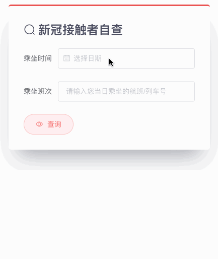

# ContactsCheck



ContactsCheckResultDialog component checks whether you have traveled with COVID-19 patients by travel date and the number of the vehicle. 

## Usage

```vue
<template>
  <contacts-check post="/contacts_check_safe.json"></contacts-check>
</template>

<script>
import ContactsCheck from '@/components/ContactsCheck.vue'
export default {
  components: {
    'contacts-check': ContactsCheck,
  },
}
</script>
```

## Attributes

| Attribute   | Description                                              | Type   | Options                                                      | Default    |
| ----------- | -------------------------------------------------------- | ------ | ------------------------------------------------------------ | ---------- |
| post        | post url based on axios baseURL                          | string | -                                                            | -          |
| valueFormat | format of binding date value sent to the server by axios | string | see [date formats](https://element.eleme.cn/#/en-US/component/date-picker#date-formats) | yyyy-MM-dd |

## API

* Method: `POST`
* Test URL: `/contacts_check_safe.json`, `/contacts_check_danger.json`

### Query Params

| Attribute | Description                                           | Type   | Options           | Require |
| --------- | ----------------------------------------------------- | ------ | ----------------- | ------- |
| date      | date, its format appointed by attribute `valueFormat` | string | see `valueFormat` | +       |
| number    | -                                                     | string | -                 | +       |

### Response

There are two kinds of responses: 

```json
// static/mock/contacts_check_safe.json
{
  "res": "0",
  "msg": "数据库中未查询到您与确诊或疑似人员同乘同一交通工具，请继续保持有效防护。"
}

// static/mock/contacts_check_danger.json
{
  "res": "1",
  "msg": "查询到您与确诊或疑似人员同乘同一交通工具，请您做好个人防护，通过“国家政务服务平台”自查是否为“同行密接人员”，以便进一步核查您的健康状况！"
}
```
