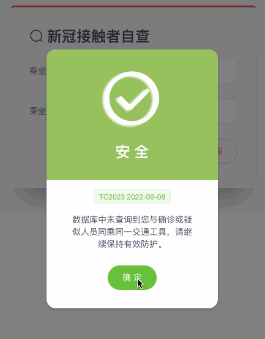
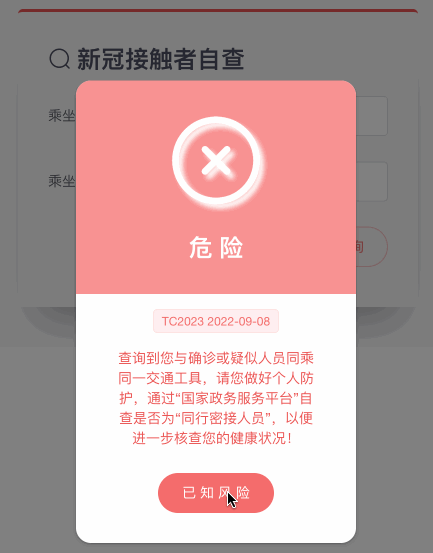

# ContactsCheckResultDialog

 

ContactsCheckResultDialog component shows the result of your health status coming from ContactsCheck. 

## Usage

```vue
<template>
  <contacts-check-result-dialog
    :dialogVisible="dialogVisible"
    :isContact="isContact"
    :date="contactsCheckForm.date"
    :number="contactsCheckForm.number"
    :message="result.msg"
    @hideDialog="dialogVisible = false"
  ></contacts-check-result-dialog>
</template>

<script>
import ContactsCheckResultDialog from '@/components/ContactsCheckResultDialog.vue'
export default {
  components: {
    'contacts-check-result-dialog': ContactsCheckResultDialog,
  },
  data() {
    return {
      dialogVisible: false,
      contactsCheckForm: {
        date: '',
        number: '',
      },
      result: {
        res: '',
        msg: '',
      },
    }
  },
  computed: {
    isContact() {
      return this.result.res === '1'
    },
  },
}
</script>
```

## Attributes

| Attribute     | Description                                                  | Type    | Options | Default |
| ------------- | ------------------------------------------------------------ | ------- | ------- | ------- |
| dialogVisible | visibility of Dialog (The child component emits an event on itself by calling the built-in `$emit` method to change the value of `dialogVisible` from its parent.) | boolean | -       | false   |
| isContact     | style of Dialog when a person is a contact or not            | boolean | -       | false   |
| date          | date to show in Dialog                                       | string  | -       | -       |
| number        | number to show in Dialog                                     | string  | -       | -       |
| message       | message to show in Dialog                                    | string  | -       | -       |
