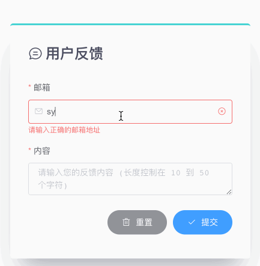

# Feedback



Feedback component submits email and content to the server with axios. It supports data validation and POST request url configuration. 

## Usage

```vue
<template>
  <feedback post="/feedback_success.json"></feedback>
</template>

<script>
import Feedback from '@/components/Feedback.vue'
export default {
  components: {
    feedback: Feedback,
  },
}
</script>
```

Attribute `post` is based on axios baseURL. For example, the form will be submitted to `http://localhost:devServerPort/static/mock/feedback_success.json`. The submitted attributes include `email` and `content`, of which `string` should be the type. 

## Attributes

| Attribute | Description                     | Type   | Options | Default |
| --------- | ------------------------------- | ------ | ------- | ------- |
| post      | post url based on axios baseURL | string | -       | -       |

## API

* Method: `POST`
* Test URL: `/feedback_success.json`, `/feedback_error.json`

### Query Params

| Attribute | Description | Type   | Options | Require |
| --------- | ----------- | ------ | ------- | ------- |
| email     | -           | string | -       | +       |
| content   | -           | string | -       | +       |

### Response

There are two kinds of responses: 

```json
// static/mock/feedback_success.json
{ "res": "1", "msg": "反馈提交成功！" }

// static/mock/feedback_error.json
{ "res": "0", "msg": "反馈提交失败！" }
```
