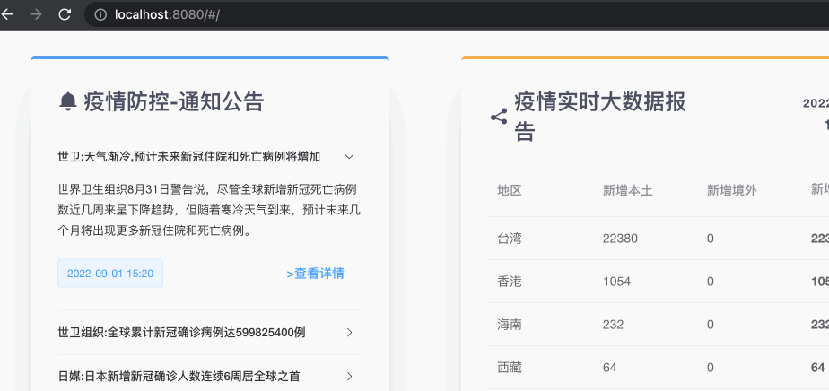

# MyHeader&Footer

## MyHeader



We design an adaptive navigation component `MyHeader` with `NavMenu` component of Element UI and `Nested Routes` of Vue Router. 

### Usage

```vue
<template>
  <my-header :isCollapsed="!isCollapsed"></my-header>
</template>

<script>
import MyHeader from '@/components/MyHeader.vue'
export default {
  data() {
    return {
      clientWidth: null,
      minCollapsedWidth: 1024,
    }
  },
  computed: {
    isCollapsed: function() {
      return this.clientWidth >= this.minCollapsedWidth
    },
  },
  mounted() {
    this.clientWidth = document.body.clientWidth
    // register window resize event
    window.onresize = () => {
      this.clientWidth = document.body.clientWidth
    }
  },
  components: {
    'my-header': MyHeader,
  },
}
</script>
```

What’s going on here:

* In `data`, we set `minCollapsedWidth` to define the minimal width, under which the header bar will be expanded. The unit of it is `px`. 
* After components **mounted**, we register a window resize event to listen the change of `document.body.clientWidth` and pass it to `clientWidth`. 
* Our component `my-header` accepts a prop `isCollapsed`, which decides whether the component is shown. 

### Attributes

| Attribute   | Description                                         | Type    | Options | Default |
| ----------- | --------------------------------------------------- | ------- | ------- | ------- |
| isCollapsed | to decide whether the header bar be expanded or not | boolean | -       | true    |

### Nested Routes

```
/                                     /feedback
+------------------+                  +-----------------+
| HelloWorld       |                  | HelloWorld      |
| +--------------+ |                  | +-------------+ |
| | Statistics   | |  +------------>  | | Feedback    | |
| |              | |                  | |             | |
| +--------------+ |                  | +-------------+ |
+------------------+                  +-----------------+
```

To configure our routes conveniently, we create `routes.js` in `router` folder:

```js
// src/router/routes.js
import HelloWorld from '@/components/HelloWorld'
import Statistics from '@/components/Statistics.vue'
import Feedback from '@/components/Feedback.vue'
// ...
const urls = require('@/utils/urls')

export default [
  {
    path: '/',
    component: HelloWorld,
    children: [
      {
        path: '/',
        name: 'Statistics',
        displayName: '实时数据',
        component: Statistics,
        alias: 'statistics',
        props: {
          get: urls.statistics,
        },
      },
      // ...
      {
        path: '/feedback',
        name: 'Feedback',
        displayName: '反馈',
        component: Feedback,
        props: {
          post: urls.feedback,
        },
      },
    ],
  },
]
```

What’s going on here:

* All our components are composed under the main component `HelloWorld.vue`. With `vue-router`, it is very simple to express this relationship using nested route configurations. 
* In `src > components > HelloWorld.vue > template > el-container.HelloWorld > el-container > el-main`, the components will be rendered in nested `<router-view>` here. To render components into this nested outlet, we need to use the `children` option in `VueRouter` constructor config by importing the `routes.js` in `src/router/index.js`. 
* Note that nested paths that start with `/` will be treated as a **root path**. You can see we set an alias for the root path `Statistics`, so that it is same when you visit `/` or `/statistics`. 
* The `children` option is just another Array of route configuration objects like `routes` itself. `displayName` in each Array item will be shown in `MyHeader` component. Thus we need to import `routes.js` in `MyHeader.vue`. 
* `src/utils/urls.js` **provides urls required by forms when submitting**. 

## MyFooter

`MyFooter` component shows some basic information about our website. 

### Usage

```vue
<template>
  <my-footer></my-footer>
</template>

<script>
import MyFooter from '@/components/MyFooter.vue'
export default {
  components: {
    'my-footer': MyFooter,
  },
}
</script>
```

### Show off

<p class="codepen" data-height="300" data-default-tab="html,result" data-slug-hash="eYrGqGP" data-user="sylvanding" style="height: 300px; box-sizing: border-box; display: flex; align-items: center; justify-content: center; border: 2px solid; margin: 1em 0; padding: 1em;">
  <span>See the Pen <a href="https://codepen.io/sylvanding/pen/eYrGqGP">
  covid19-self-triage-MyFooter</a> by Sylvan Ding (<a href="https://codepen.io/sylvanding">@sylvanding</a>)
  on <a href="https://codepen.io">CodePen</a>.</span>
</p>
<script async src="https://cpwebassets.codepen.io/assets/embed/ei.js"></script>
