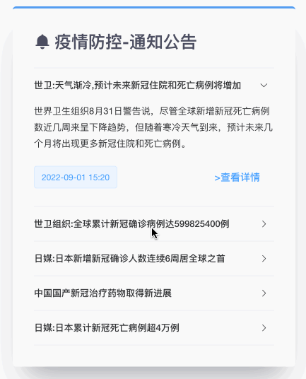

# Notice



Notice component shows the latest news and notifications of COVID-19 in every province or district. 

## Usage

```vue
<template>
  <notice get="/notice.json"></notice>
</template>

<script>
import Notice from '@/components/Notice.vue'
export default {
  components: {
    notice: Notice,
  },
}
</script>
```

## Attributes

| Attribute | Description                                   | Type   | Options | Default |
| --------- | --------------------------------------------- | ------ | ------- | ------- |
| get       | url based on axios baseURL to get notice data | string | -       | -       |

## API

* Method: `GET`
* Test URL: `/notice.json`

### Query Params

None

### Response

```json
[
  {
    "title": "世卫:天气渐冷,预计未来新冠住院和死亡病例将增加",
    "link": "https://baijiahao.baidu.com/s?id=1742750952450851132",
    "abstract": "世界卫生组织8月31日警告说，尽管全球新增新冠死亡病例数近几周来呈下降趋势，但随着寒冷天气到来，预计未来几个月将出现更多新冠住院和死亡病例。",
    "time": "2022-09-01 15:20"
  },
  {
    "title": "世卫组织:全球累计新冠确诊病例达599825400例",
    "link": "https://baijiahao.baidu.com/s?id=1742738463015994577",
    "abstract": "世卫组织网站最新数据显示，截至欧洲中部时间8月31日18时3分（北京时间9月1日零时3分），全球确诊病例较前一日增加644248例，达到599825400例；死亡病例增加1866例，达到6469458例。",
    "time": "2022-09-01 12:00"
  }
]
```
