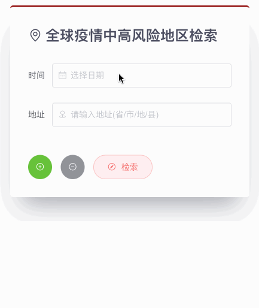

# RegionsSearch



RegionsSearch component searches nearby areas at medium or high risk of COVID-19 according to an address and a date. Users should only select addresses from input tips or the first suggestion will be selected as default. This principle helps get the detailed information of an accurate address. 

## Usage

```vue
<template>
  <regions-search post="/regions_search.json"></regions-search>
</template>

<script>
import RegionsSearch from '@/components/RegionsSearch.vue'
export default {
  components: {
    'regions-search': RegionsSearch,
  },
}
</script>
```

## Attributes

| Attribute      | Description                                              | Type   | Options                                                      | Default    |
| -------------- | -------------------------------------------------------- | ------ | ------------------------------------------------------------ | ---------- |
| post           | post url based on axios baseURL                          | string | -                                                            | -          |
| valueFormat    | format of binding date value sent to the server by axios | string | see [date formats](https://element.eleme.cn/#/en-US/component/date-picker#date-formats) | yyyy-MM-dd |
| maxItemPlugNum | the extra sets of data submitted in the form             | int    | -                                                            | 2          |

## API

* Method: `POST`
* Test URL: `/regions_search.json`

### Query Params

Query sent by this components should be a JSON array object. Each item of it contains: 

| Attribute | Description                                                  | Type   | Options           | Require |
| --------- | ------------------------------------------------------------ | ------ | ----------------- | ------- |
| date      | date, its format appointed by attribute `valueFormat`        | string | see `valueFormat` | +       |
| place     | -                                                            | string | -                 | +       |
| source    | source data from [lbs.amap](https://lbs.amap.com/api/webservice/guide/api/inputtips), including *id, name, district, adcode, location, address* | object | -                 | -       |

### Response

```json
// static/mock/regions_search.json

[
  {
    "date": "2022-02-03",
    "place": "福建省厦门市集美区华侨大学(厦门校区)",
    "result": {
      "isSafe": "1",
      "nearby": [],
      "msg": "安全！未检测到附近存在中高风险地区"
    }
  },
  {
    "date": "2022-04-05",
    "place": "厦门市集美区滨水路水晶湖郡",
    "result": {
      "isSafe": "0",
      "nearby": [
        "滨水一里",
        "滨水二里",
        "滨水小区",
        "水晶湖郡-1期",
        "水晶湖郡三期"
      ],
      "msg": "危险！检测到附近存在中高风险地区：滨水一里、滨水二里、滨水小区、水晶湖郡-1期、水晶湖郡三期"
    }
  }
]
```

## POI

We use `el-autocomplete` component and `inputTips` API from [lbs.amap](https://lbs.amap.com/api/webservice/guide/api/inputtips), which helps realize the Query Autocomplete service. The Query Autocomplete can be used to provide a query prediction for text-based geographic searches, by returning suggested queries as you type. Note that you can only use this service 5,000 times per day. We set `inputTipsOpen = false` when the service reaches the limit or something wrong happens with API server. 

```vue
<template>
  <el-autocomplete
    v-model="place"
    :fetch-suggestions="querySearchAsync"
    placeholder="请输入地址(省/市/地/县)"
    :trigger-on-focus="false"
    :clearable="true"
    prefix-icon="el-icon-place"
  ></el-autocomplete>
</template>

<script>
import request from '@/utils/request'
import { errorMsg, infoMsg } from '@/utils/msgsettings.js'
export default {
  data() {
    return {
      place: '',
      addresses: [],
      timeout: null,
      inputTipsOpen: true,
    }
  },
  methods: {
    querySearchAsync(queryString, cb) {
      this.addresses.splice(0, this.addresses.length)
      this.inputTips(queryString)
      clearTimeout(this.timeout)
      this.timeout = setTimeout(() => {
        cb(this.addresses)
      }, 600)
    },
    inputTips(queryString) {
      // ! frequency limit: 5,000 times per day
      // https://lbs.amap.com/api/webservice/guide/api/inputtips
      request
        .request({
          url: '/inputtips',
          baseURL: 'https://restapi.amap.com/v3/assistant/',
          params: {
            keywords: queryString,
            datatype: 'poi',
            key: 'fdfb60635a509cd63bd5db298be7dc28',
          },
        })
        .then((response) => {
          var { status, info, tips } = response.data
          if (status === '1') {
            this.addresses = tips.map((value) => {
              // {value, id, name, district, adcode, location, address}
              return {
                value: `${value.district}${value.name}`,
                ...value,
              }
            })
          } else {
            if (this.inputTipsOpen) {
              errorMsg(info)
              this.inputTipsOpen = false
            }
          }
        })
        .catch(() => {})
    },
  },
}
</script>
```

## Notification Overlapping Problem

When calling `this.$notify` method many times in one method, there will be a problem of overlapping notification boxes. We solve the problem by using `Promise.resolve` function, which returns either the promise of the promise fulfilled with its value. 

```vue
<script>
export default {
  data() {
    return {
      results: [],
      notifyPromise: Promise.resolve(),
    }
  },
  methods: {
    notify() {
      const h = this.$createElement
      for (let item of this.results) {
        // to solve the problem of overlapping notifications
        this.notifyPromise = this.notifyPromise.then(() => {
          this.$notify({
            title: item.place,
            type: isSafe ? 'success' : 'error',
            message: h(
              'div',
              { class: 'regions-search-notify', danger: !isSafe },
              [
                h(
                  'p',
                  { class: 'date', attrs: { danger: !isSafe } },
                  `日期：${item.date}`
                ),
                h(
                  'p',
                  { class: 'msg', attrs: { danger: !isSafe } },
                  item.result.msg
                ),
              ]
            ),
          })
        })
      }
    },
  },
}
</script>
```

## Vue.VNode

Vue automatically keeps the page updated by building a **virtual DOM** to keep track of the changes it needs to make to the real DOM. `createElement` actually returning? It’s not *exactly* a real DOM element. It could perhaps more accurately be named `createNodeDescription`, as it contains information describing to Vue what kind of node it should render on the page, including descriptions of any child nodes. We call this node description a “virtual node”, usually abbreviated to **VNode**. “Virtual DOM” is what we call the entire tree of VNodes, built by a tree of Vue components.

In Notification component, we use `h()` to create VNode. In the previous section, we show the code in `notify()`. 

> The full `VNode` interface contains many other internal properties, but it is strongly recommended to avoid relying on any properties other than the ones listed here. This avoids unintended breakage in case the internal properties are changed.
>
> Aliasing `createElement` to `h` is a common convention you’ll see in the Vue ecosystem and is actually required for JSX. Starting with [version 3.4.0](https://github.com/vuejs/babel-plugin-transform-vue-jsx#h-auto-injection) of the Babel plugin for Vue, we automatically inject `const h = this.$createElement` in any method and getter (not functions or arrow functions), declared in ES2015 syntax that has JSX, so you can drop the `(h)` parameter. 
>
> For a detailed explanation, check out [Render Functions & JSX](https://v2.vuejs.org/v2/guide/render-function.html). 
