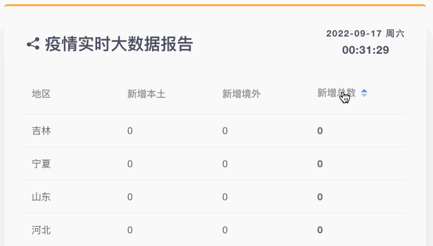

# Statistics



Statistics component shows current data report of COVID-19, providing data sorting function. 

## Usage

```vue
<template>
  <statistics get="/statistics.json"></statistics>
</template>

<script>
import Statistics from '@/components/Statistics.vue'
export default {
  components: {
    statistics: Statistics,
  },
}
</script>
```

## Attributes

| Attribute | Description                                       | Type   | Options | Default |
| --------- | ------------------------------------------------- | ------ | ------- | ------- |
| get       | url based on axios baseURL to get statistics data | string | -       | -       |

## API

* Method: `GET`
* Test URL: `/statistics.json`

### Query Params

None

### Response

```json
[
  {
    "foreign": "6",
    "local": "1",
    "province": "上海",
    "total": "7"
  },
  {
    "foreign": "0",
    "local": "1",
    "province": "云南",
    "total": "1"
  },
  {
    "foreign": "0",
    "local": "3",
    "province": "内蒙古",
    "total": "3"
  }
]
```
