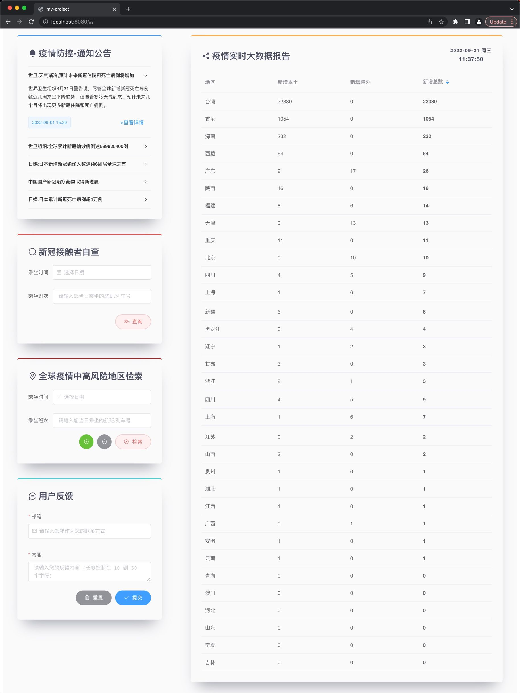

  
  <h3 align="center">COVID19-Self-Triage</h3>
  
  
  

    Sylvan Ding's first Vue.js project. It helps users find more information about COVID-19 and assuage their panic. Docs are updated at {docsify-updated}. 
     
    <a href="http://sylvanding.github.io/covid19-self-triage"><strong>Explore the docs »</strong></a>
     
     
    <a href="https://github.com/sylvanding/covid19-self-triage">View Demo</a>
    ·
    <a href="https://github.com/sylvanding/covid19-self-triage/issues">Report Bug</a>
    ·
    <a href="https://github.com/sylvanding/covid19-self-triage/pulls">Request Feature</a>
  

   

